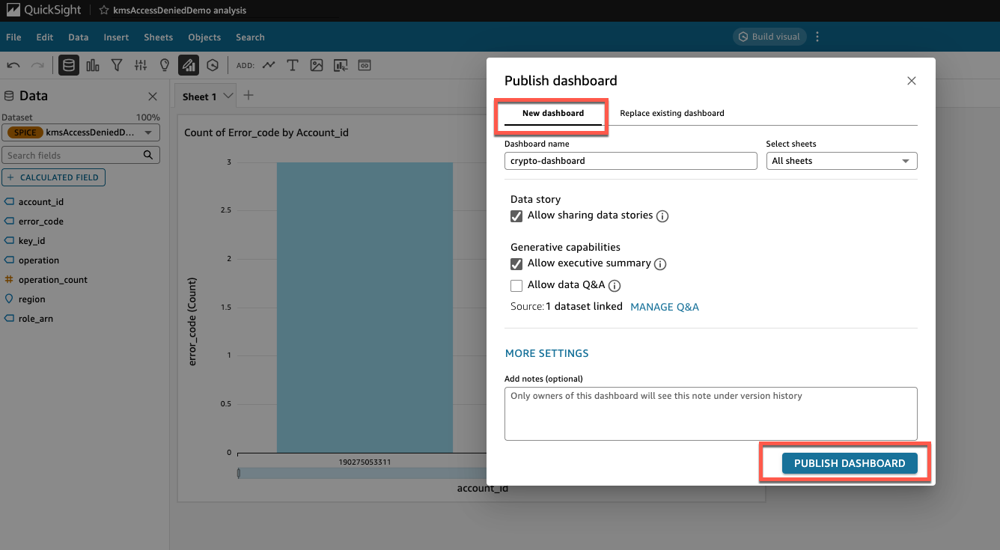

# 📊 AWS Crypto Asset Monitoring Dashboards
## 📋 A Guide for Creating Interactive Crypto Asset Dashboards with Amazon QuickSight

## 📝 Introduction

This guide is part of the AWS Crypto Asset Monitoring sample solution, which provides a foundation for monitoring and securing AWS crypto assets across your organization. The Amazon QuickSight dashboards described here represent the visualization layer of this comprehensive monitoring pipeline, enabling you to transform security data into actionable insights.

These sample dashboards demonstrate how you can visualize crypto asset security metrics to identify unused or misconfigured AWS Key Management Service (AWS KMS) keys, AWS Certificate Manager (ACM) certificates, and AWS Secrets Manager secrets. By following this guide, you'll see how to create dashboards that help maintain proper security hygiene and optimize costs across your AWS organization.

### How Dashboards Fit into the Solution

The AWS Crypto Asset Monitoring solution follows a four-layer architecture:

1. **Detection Layer**:
   - AWS CloudTrail captures API activity related to crypto assets
   - AWS Config rules (implemented as Lambda functions) continuously evaluate crypto assets against best practices
   - AWS Security Hub provides additional security checks and standards compliance evaluation

2. **Collection Layer**:
   - AWS Security Hub centralizes and normalizes findings from AWS Config rules
   - AWS Security Lake stores security data for long-term analysis and querying

3. **Analysis Layer**:
   - Amazon Athena queries extract specific insights from Security Lake data
   - Queries target security findings, usage patterns, and compliance status of crypto assets

4. **Visualization Layer**:
   - Amazon QuickSight dashboards (covered in this guide) transform analyzed data into visual insights
   - Interactive visualizations help identify security issues, optimize costs, and ensure compliance

These sample dashboards serve as the final step in this monitoring pipeline, transforming raw data into visual insights that help you identify security issues, optimize costs, and ensure compliance.

### Dashboard Types and Their Purpose

This sample solution includes three main dashboard types:

- **AWS KMS Dashboard**: Monitors key usage patterns, rotation status, and access denied events
- **AWS Certificate Manager Dashboard**: Tracks certificate expirations, validations, and issuance/revocation patterns
- **AWS Secrets Manager Dashboard**: Monitors secret usage patterns, rotation status, and access events

### Key Monitoring Scenarios

These sample dashboards support several important monitoring scenarios:

- **Identifying Unused Crypto Assets**: Visualize AWS KMS keys and AWS Secrets Manager secrets that haven't been used in a specified period
- **Detecting Access Issues**: Monitor access denied events that might indicate permission problems
- **Certificate Lifecycle Management**: Track AWS Certificate Manager certificate expirations to prevent service disruptions
- **Compliance Monitoring**: Ensure crypto assets meet security best practices (e.g., rotation enabled)

Remember that these dashboards are provided as examples that you can customize and extend to meet your specific requirements.

## ✅ Prerequisites

Before you begin, ensure you have:
- Completed the dataset creation process as described in the [Amazon QuickSight Dataset Creation Guide](amazon-quicksight-dataset-creation-guide.md)
- Access to Amazon QuickSight with appropriate permissions
- The datasets you want to visualize already created and available in QuickSight

## 📑 Table of Contents

- [Creating Amazon QuickSight Dashboards](#creating-amazon-quicksight-dashboards)
  - [Introduction](#introduction)
  - [Prerequisites](#prerequisites)
  - [Accessing Amazon QuickSight Analysis](#accessing-amazon-quicksight-analysis)
  - [Selecting Your Dataset](#selecting-your-dataset)
  - [Creating a New Analysis](#creating-a-new-analysis)
  - [Building Dashboard Visualizations](#building-dashboard-visualizations)
    - [Creating a Bar Chart](#creating-a-bar-chart)
    - [Adding Additional Visualizations](#adding-additional-visualizations)
  - [Publishing Your Dashboard](#publishing-your-dashboard)
  - [Next Steps](#next-steps)

## 🔑 Accessing Amazon QuickSight Analysis

1. Navigate to the Amazon QuickSight homepage.
2. Select the **Analyses** section from the navigation panel.
3. Click the **New analysis** button to begin creating a new dashboard.

   

## 📁 Selecting Your Dataset

1. From the dataset selection screen, locate and select the dataset you created in the previous section.

   

2. Click **Use in analysis** to proceed with the selected dataset.

   

## 🆕 Creating a New Analysis

1. In the new analysis configuration screen:
   - Select **New sheet** to create a fresh dashboard
   - Choose **Tiled** layout for a structured dashboard design
   - Click **Create** to generate your new analysis sheet

   

   > **Note**: While this guide uses the tiled layout, you're free to experiment with other layout options based on your visualization needs.

## 📈 Building Dashboard Visualizations

### 📊 Creating a Bar Chart

1. In the dashboard editor, select **Vertical bar chart** from the visual types menu.

   

2. Configure your bar chart:
   - Set the X-axis attribute to **account_id** to display access denied events by AWS account
   - Adjust other properties as needed for your specific visualization requirements
   - This example shows one approach, but you can customize the visualization based on the metrics that are most important for your organization

   

3. Review your completed bar chart visualization in the dashboard.

   

### ➕ Adding Additional Visualizations

1. To add another visualization to your dashboard, click the **Add** button in the top menu bar.

   

2. Select the appropriate visual type for your next visualization.
3. Configure the new visualization using fields from your dataset.
4. Repeat this process to add all desired visualizations to your dashboard.

## 🚀 Publishing Your Dashboard

1. When you're satisfied with your dashboard design, click the **Publish** button in the top-right corner.

   

2. In the publishing dialog:
   - Select **New dashboard** (for first-time publishing)
   - Enter a descriptive name for your dashboard
   - Click **Publish dashboard** to finalize

   

3. Your dashboard is now published and available for viewing by authorized users.

   

## 🔄 Next Steps

Now that you've created and published your sample dashboard:

1. **Customize for Your Environment**: Adapt these sample dashboards to reflect your organization's specific security requirements and crypto asset usage patterns
2. **Share with Stakeholders**: Provide access to security teams, operations teams, and management who need visibility into crypto asset security
3. **Schedule Regular Refreshes**: Configure automatic data refreshes to ensure your dashboards display current information
4. **Set Up Alerts**: Create alerts on key metrics to be notified of important security events
5. **Integrate with Workflows**: Connect dashboard insights to your incident response and remediation workflows

### Customization Options

As this is a sample solution, you can extend these dashboards in several ways:

1. **Role-Based Dashboards**: Create specialized views for different teams (security, operations, management)
2. **Additional Metrics**: Incorporate other security metrics relevant to your organization
3. **Custom Thresholds**: Adjust visualization thresholds to match your security policies
4. **Trend Analysis**: Add time-based visualizations to track security metrics over time

## 📊 Sample Dashboard Examples

> **Important Security Note**: When creating and sharing dashboards, ensure that all sensitive information such as organization IDs, AWS account numbers, and other identifiable information is properly redacted. The sample images below have been redacted for security purposes.

Below are examples of dashboards you can create to monitor your AWS crypto assets:

### AWS KMS Dashboard Example

This dashboard provides visibility into your AWS KMS keys usage, rotation status, and access patterns.

### AWS Certificate Manager Dashboard Example

This dashboard helps you monitor your AWS Certificate Manager certificates, including expiration dates, validation status, and usage patterns.

### AWS Secrets Manager Dashboard Example

This dashboard provides insights into your AWS Secrets Manager secrets, including rotation status, access patterns, and usage metrics.

This example provides a foundation that you can build upon to create visualization tools tailored to your specific crypto asset security monitoring needs. Adapt and extend these samples to create dashboards that highlight the metrics most important to your organization.
