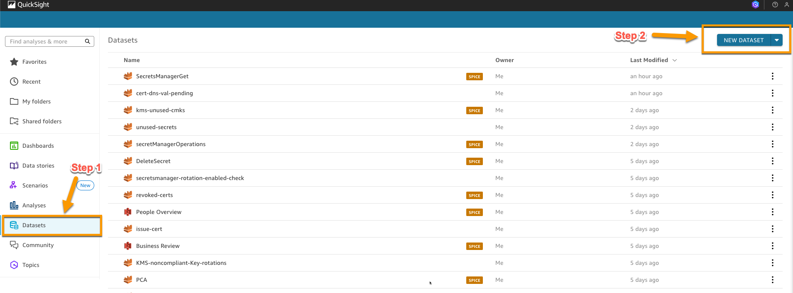
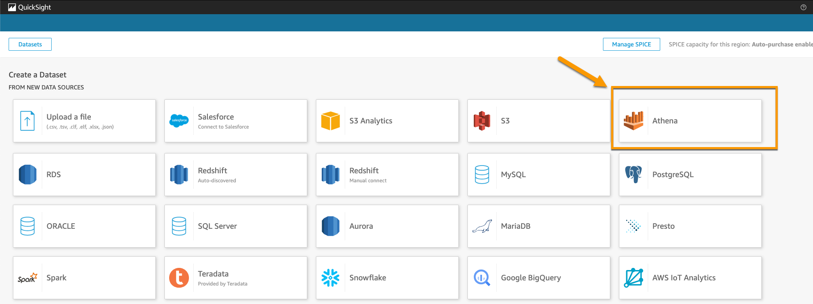
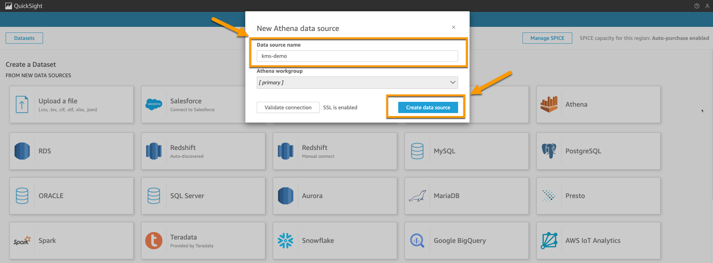
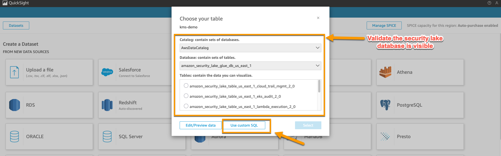
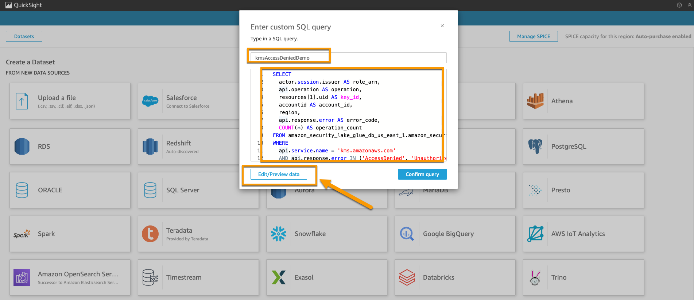
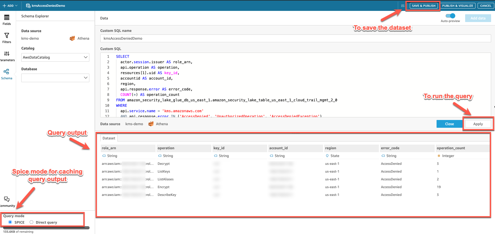
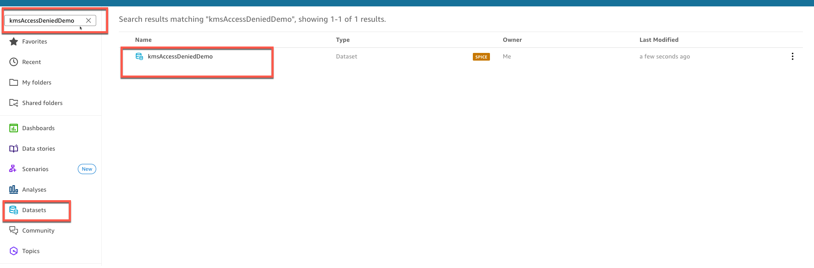

# 📊 Creating Amazon QuickSight Datasets from Athena Queries

## 📝 Introduction

This guide provides an example approach for creating datasets in Amazon QuickSight using Athena queries. These sample datasets demonstrate how you can build a foundation for interactive dashboards to monitor AWS crypto asset security. By following these steps, you'll see one way to transform Athena query results into visualizable datasets in Amazon QuickSight, which you can customize to meet your specific requirements.

## ✅ Prerequisites

Before you begin, ensure you have:
- An active AWS account with access to Amazon QuickSight and Amazon Athena
- Appropriate permissions to access the Security Lake database through Lake Formation
- The Athena queries from the `athena-queries` folder in this repository
- Basic familiarity with SQL and Amazon QuickSight interface

## 📑 Table of Contents

- [Creating Amazon QuickSight Datasets from Athena Queries](#creating-amazon-quicksight-datasets-from-athena-queries)
  - [Introduction](#introduction)
  - [Prerequisites](#prerequisites)
  - [Accessing Amazon QuickSight](#accessing-amazon-quicksight)
  - [Creating a New Dataset](#creating-a-new-dataset)
  - [Connecting to Amazon Athena](#connecting-to-amazon-athena)
  - [Using Custom SQL Queries](#using-custom-sql-queries)
  - [Previewing and Saving Your Dataset](#previewing-and-saving-your-dataset)
  - [Troubleshooting](#troubleshooting)
  - [Next Steps](#next-steps)

## 🔑 Accessing Amazon QuickSight

1. Sign in to the AWS Management Console.
2. Navigate to Amazon QuickSight by visiting https://quicksight.aws.amazon.com/ or selecting QuickSight from the AWS services menu.

## 🆕 Creating a New Dataset

1. From the Amazon QuickSight homepage, select **Datasets** from the navigation panel.
2. Click the **New dataset** button.

   

## 🔌 Connecting to Amazon Athena

1. In the data source selection screen, locate and select **Athena**.

   

2. Configure your data source:
   - Enter a descriptive **Data source name** that identifies the purpose of this connection.
   - Click **Create data source** to establish the connection.

   

## 🔍 Using Custom SQL Queries

1. In the Choose your table screen, select **Use custom SQL**.
   
   > **Important**: Verify that the Amazon Security Lake database created by AWS Glue is visible in the dropdown menu. This confirms that your QuickSight account has proper access to the Security Lake database.

   

   > **Note**: If you cannot see the database, you need to grant your QuickSight user ID access to the Security Lake database through Lake Formation. Ensure that Security Lake is properly configured with Lake Formation.

2. Create your custom query:
   - Copy an SQL query from the `athena-queries` folder. These sample queries provide starting points that you can modify to suit your specific monitoring needs.
   - Paste the query into the provided text box.
   - Enter a descriptive name for your query in the **Query name** field.
   - Click **Edit/Preview data** to proceed.

   

## 💾 Previewing and Saving Your Dataset

1. Review the query results in the preview pane.
2. Make any necessary adjustments to your data:
   - Modify field names or data types as needed.
   - Apply filters or create calculated fields if required.
3. When satisfied with the dataset:
   - Click **Save & publish** in the upper right corner to finalize your dataset.

   

4. Verify that your new dataset appears in the Datasets section of the QuickSight homepage.

   

## 🔧 Troubleshooting

- **Database not visible**: If you cannot see the Security Lake database, verify that your QuickSight service role has the necessary permissions in Lake Formation.
- **Query errors**: Double-check your SQL syntax and ensure that all referenced tables and columns exist in the database.
- **Empty results**: Confirm that your query is correctly filtering data and that the underlying tables contain the expected information.

## 🚀 Next Steps

Now that you've seen how to create a sample dataset in Amazon QuickSight:
1. Create additional datasets using other queries from the `athena-queries` folder, customizing them to your specific monitoring requirements.
2. Proceed to build interactive dashboards using your newly created datasets, adapting the visualizations to highlight the metrics most important to your organization.
3. Configure automatic refresh schedules for your datasets to ensure your dashboards display the most current information.

This example provides a foundation that you can build upon to create a monitoring solution tailored to your specific crypto asset security needs. For more information on creating dashboards, refer to the [Amazon QuickSight Dashboard Creation Guide](amazon-quicksight-dashboard-creation-guide.md).
