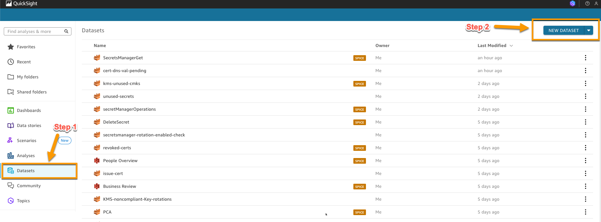
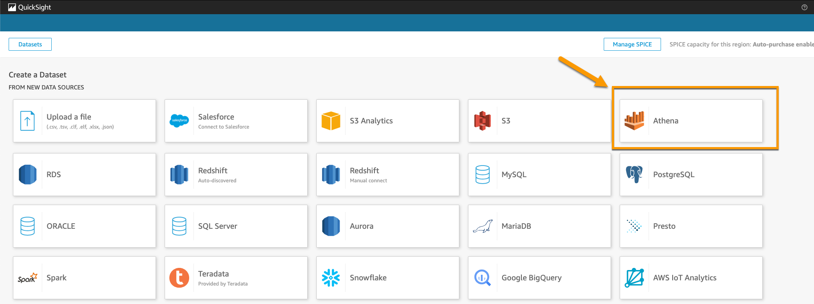
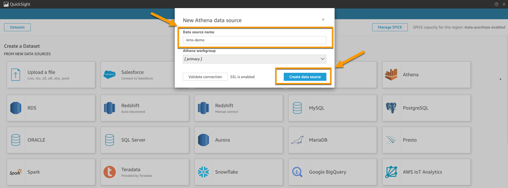
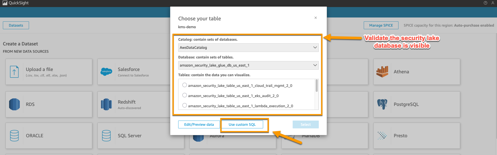
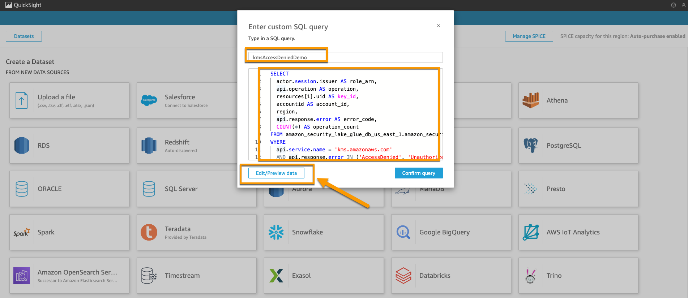
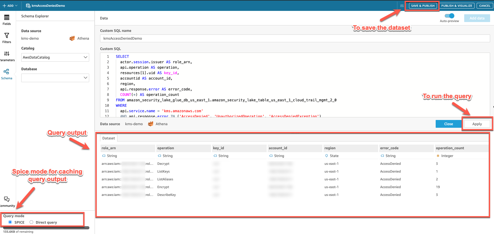
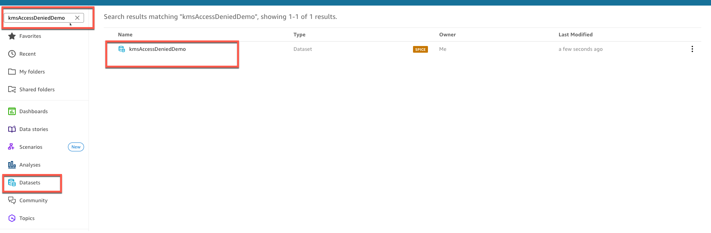

# 📊 AWS Crypto Asset Monitoring Datasets
## 📋 A Guide for Creating Security Data Models with Amazon QuickSight and Amazon Athena

## 📝 Introduction

This guide is part of the AWS Crypto Asset Monitoring sample solution, which provides a foundation for monitoring and securing AWS crypto assets across your organization. The Amazon QuickSight datasets described here represent the analysis layer of this comprehensive monitoring pipeline, bridging the gap between raw security data and actionable visualizations.

These sample datasets demonstrate how you can transform Amazon Athena query results into structured data models that power interactive dashboards for monitoring crypto asset security. By following this guide, you'll see how to create datasets that enable visualization of security metrics for AWS Key Management Service (AWS KMS) keys, AWS Certificate Manager (ACM) certificates, and AWS Secrets Manager secrets.

### How Datasets Fit into the Solution

The AWS Crypto Asset Monitoring solution follows a four-layer architecture:

1. **Detection Layer**:
   - AWS CloudTrail captures API activity related to crypto assets
   - AWS Config rules (implemented as Lambda functions) continuously evaluate crypto assets against best practices
   - AWS Security Hub provides additional security checks and standards compliance evaluation

2. **Collection Layer**:
   - AWS Security Hub centralizes and normalizes findings from AWS Config rules
   - AWS Security Lake stores security data for long-term analysis and querying

3. **Analysis Layer**:
   - Amazon Athena queries extract specific insights from Security Lake data
   - QuickSight datasets (covered in this guide) transform raw data into analyzable metrics
   - Queries target security findings, usage patterns, and compliance status of crypto assets

4. **Visualization Layer**:
   - Amazon QuickSight dashboards transform analyzed data into visual insights
   - Interactive visualizations help identify security issues, optimize costs, and ensure compliance

These sample datasets serve as a critical bridge in this monitoring pipeline, transforming raw security data into structured models that can be effectively visualized and analyzed.

### Dataset Types and Their Purpose

This sample solution includes datasets for three main crypto asset types:

- **AWS KMS Datasets**: Track key usage, rotation status, and access denied events
- **AWS Certificate Manager Datasets**: Monitor certificate expirations, validations, and usage patterns
- **AWS Secrets Manager Datasets**: Analyze secret usage, rotation status, and access events

Remember that these datasets are provided as examples that you can customize and extend to meet your specific requirements.

## ✅ Prerequisites

Before you begin, ensure you have:
- An active AWS account with access to Amazon QuickSight and Amazon Athena
- Appropriate permissions to access the AWS Security Lake database through AWS Lake Formation
- The Amazon Athena queries from the `athena-queries` folder in this repository
- Basic familiarity with SQL and Amazon QuickSight interface

## 📑 Table of Contents

- [Creating Amazon QuickSight Datasets from Athena Queries](#creating-amazon-quicksight-datasets-from-athena-queries)
  - [Introduction](#introduction)
  - [Prerequisites](#prerequisites)
  - [Accessing Amazon QuickSight](#accessing-amazon-quicksight)
  - [Creating a New Dataset](#creating-a-new-dataset)
  - [Connecting to Amazon Athena](#connecting-to-amazon-athena)
  - [Using Custom SQL Queries](#using-custom-sql-queries)
  - [Previewing and Saving Your Dataset](#previewing-and-saving-your-dataset)
  - [Troubleshooting](#troubleshooting)
  - [Next Steps](#next-steps)

## 🔑 Accessing Amazon QuickSight

1. Sign in to the AWS Management Console.
2. Navigate to Amazon QuickSight by visiting https://quicksight.aws.amazon.com/ or selecting QuickSight from the AWS services menu.

## 🆕 Creating a New Dataset

1. From the Amazon QuickSight homepage, select **Datasets** from the navigation panel.
2. Click the **New dataset** button.

   

## 🔌 Connecting to Amazon Athena

1. In the data source selection screen, locate and select **Amazon Athena**.

   

2. Configure your data source:
   - Enter a descriptive **Data source name** that identifies the purpose of this connection.
   - Click **Create data source** to establish the connection.

   

## 🔍 Using Custom SQL Queries

1. In the Choose your table screen, select **Use custom SQL**.
   
   > **Important**: Verify that the AWS Security Lake database created by AWS Glue is visible in the dropdown menu. This confirms that your Amazon QuickSight account has proper access to the AWS Security Lake database.

   

   > **Note**: If you cannot see the database, you need to grant your Amazon QuickSight user ID access to the AWS Security Lake database through AWS Lake Formation. Ensure that AWS Security Lake is properly configured with AWS Lake Formation.

2. Create your custom query:
   - Copy an SQL query from the `athena-queries` folder. These sample queries provide starting points that you can modify to suit your specific monitoring needs.
   - Paste the query into the provided text box.
   - Enter a descriptive name for your query in the **Query name** field.
   - Click **Edit/Preview data** to proceed.

   

## 💾 Previewing and Saving Your Dataset

1. Review the query results in the preview pane.
2. Make any necessary adjustments to your data:
   - Modify field names or data types as needed.
   - Apply filters or create calculated fields if required.
3. When satisfied with the dataset:
   - Click **Save & publish** in the upper right corner to finalize your dataset.

   

4. Verify that your new dataset appears in the Datasets section of the QuickSight homepage.

   

## 🔧 Troubleshooting

- **Database not visible**: If you cannot see the AWS Security Lake database, verify that your Amazon QuickSight service role has the necessary permissions in AWS Lake Formation.
- **Query errors**: Double-check your SQL syntax and ensure that all referenced tables and columns exist in the database.
- **Empty results**: Confirm that your query is correctly filtering data and that the underlying tables contain the expected information.

## 🚀 Next Steps

Now that you've created a sample dataset in Amazon QuickSight:

1. **Create Additional Datasets**: Use other queries from the `athena-queries` folder to build a comprehensive monitoring solution:
   - KMS queries for monitoring key usage and rotation status
   - Certificate Manager queries for tracking certificate expirations and validations
   - Secrets Manager queries for analyzing secret usage and rotation compliance

2. **Customize for Your Environment**: Modify the sample queries to reflect your organization's specific security requirements and crypto asset usage patterns

3. **Configure Refresh Schedules**: Set up automatic data refreshes to ensure your datasets contain current information

4. **Build Interactive Dashboards**: Use these datasets to create visualizations that provide actionable insights into your crypto asset security posture

### Sample Amazon Athena Queries

The sample solution includes several Amazon Athena queries organized by service:

- **AWS KMS Queries**:
  - `kms-access-denied.sql`: Identifies access denied events for AWS KMS keys
  - `kms-keys-without-autorotation.sql`: Identifies keys without automatic rotation
  - `kms-unused-cmks.sql`: Identifies potentially unused customer master keys

- **AWS Certificate Manager Queries**:
  - `cert-dns-validation-pending.sql`: Identifies certificates with pending validation
  - `cert-expiring-check.sql`: Identifies certificates that are expiring soon
  - `certs-issued.sql` and `certs-revoked.sql`: Track certificate lifecycle events

- **AWS Secrets Manager Queries**:
  - `sm-rotation-not-enabled.sql`: Identifies secrets without rotation enabled
  - `sm-unused-secrets.sql`: Identifies potentially unused secrets
  - `sm-access-denied.sql`: Identifies access denied events for secrets

Remember that this sample solution provides a foundation that you can build upon to create a monitoring system tailored to your specific crypto asset security needs.

For more information on creating dashboards using these datasets, refer to the [Amazon QuickSight Dashboard Creation Guide](amazon-quicksight-dashboard-creation-guide.md).
