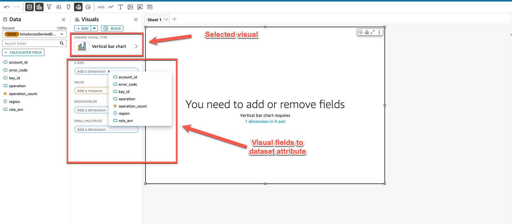

# 📊 Creating Amazon QuickSight Dashboards

## 📝 Introduction

This guide walks you through the process of creating interactive dashboards in Amazon QuickSight using your previously created datasets. Dashboards allow you to visualize your data with various chart types, enabling effective monitoring and analysis of AWS crypto asset security metrics. By following these steps, you'll be able to build customized dashboards that provide valuable insights into your security data.

## ✅ Prerequisites

Before you begin, ensure you have:
- Completed the dataset creation process as described in the [dataset.md](../datasets/dataset.md) guide
- Access to Amazon QuickSight with appropriate permissions
- The datasets you want to visualize already created and available in QuickSight

## 📑 Table of Contents

- [Creating Amazon QuickSight Dashboards](#creating-amazon-quicksight-dashboards)
  - [Introduction](#introduction)
  - [Prerequisites](#prerequisites)
  - [Accessing Amazon QuickSight Analysis](#accessing-amazon-quicksight-analysis)
  - [Selecting Your Dataset](#selecting-your-dataset)
  - [Creating a New Analysis](#creating-a-new-analysis)
  - [Building Dashboard Visualizations](#building-dashboard-visualizations)
    - [Creating a Bar Chart](#creating-a-bar-chart)
    - [Adding Additional Visualizations](#adding-additional-visualizations)
  - [Publishing Your Dashboard](#publishing-your-dashboard)
  - [Next Steps](#next-steps)

## 🔑 Accessing Amazon QuickSight Analysis

1. Navigate to the Amazon QuickSight homepage.
2. Select the **Analyses** section from the navigation panel.
3. Click the **New analysis** button to begin creating a new dashboard.

   

## 📁 Selecting Your Dataset

1. From the dataset selection screen, locate and select the dataset you created in the previous section.

   

2. Click **Use in analysis** to proceed with the selected dataset.

   

## 🆕 Creating a New Analysis

1. In the new analysis configuration screen:
   - Select **New sheet** to create a fresh dashboard
   - Choose **Tiled** layout for a structured dashboard design
   - Click **Create** to generate your new analysis sheet

   

   > **Note**: While this guide uses the tiled layout, you're free to experiment with other layout options based on your visualization needs.

## 📈 Building Dashboard Visualizations

### 📊 Creating a Bar Chart

1. In the dashboard editor, select **Vertical bar chart** from the visual types menu.

   

2. Configure your bar chart:
   - Set the X-axis attribute to **account_id** to display access denied events by AWS account
   - Adjust other properties as needed for your specific visualization requirements

   

3. Review your completed bar chart visualization in the dashboard.

   

### ➕ Adding Additional Visualizations

1. To add another visualization to your dashboard, click the **Add** button in the top menu bar.

   

2. Select the appropriate visual type for your next visualization.
3. Configure the new visualization using fields from your dataset.
4. Repeat this process to add all desired visualizations to your dashboard.

## 🚀 Publishing Your Dashboard

1. When you're satisfied with your dashboard design, click the **Publish** button in the top-right corner.

   

2. In the publishing dialog:
   - Select **New dashboard** (for first-time publishing)
   - Enter a descriptive name for your dashboard
   - Click **Publish dashboard** to finalize

   

3. Your dashboard is now published and available for viewing by authorized users.

   

## 🔄 Next Steps

Now that you've successfully created and published your dashboard:

1. **Share your dashboard** with stakeholders who need visibility into your security metrics
2. **Schedule regular refreshes** of your dashboard data to ensure up-to-date information
3. **Create additional dashboards** using other datasets to monitor different aspects of your AWS crypto asset security
4. **Set up alerts** on key metrics to be notified of important security events
5. **Iterate on your visualizations** to improve clarity and insight based on user feedback

For reference, you can view sample dashboards in the following PDF files included in this directory:
- [KMS Dashboard](KMS-dashboard.pdf): Sample dashboard for KMS key monitoring
- [Certificate Manager Dashboard](certs-dashboard.pdf): Sample dashboard for certificate monitoring
- [Secrets Manager Dashboard](Secrets_Manager_dashboard.pdf): Sample dashboard for secrets monitoring

By following this guide, you've created a powerful visualization tool for monitoring your AWS crypto asset security. Continue to refine your dashboards to meet your specific monitoring and reporting needs.
